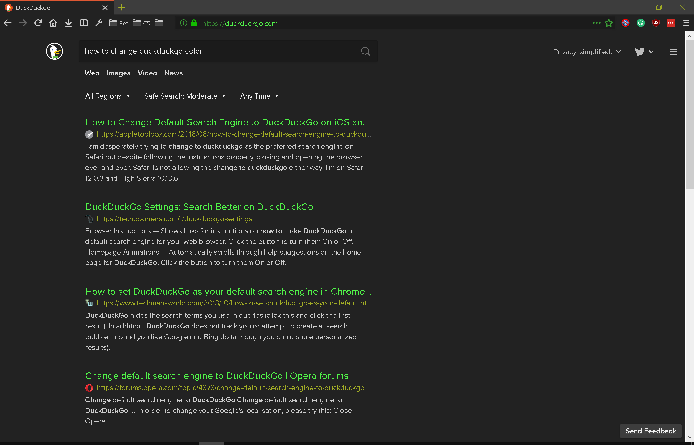
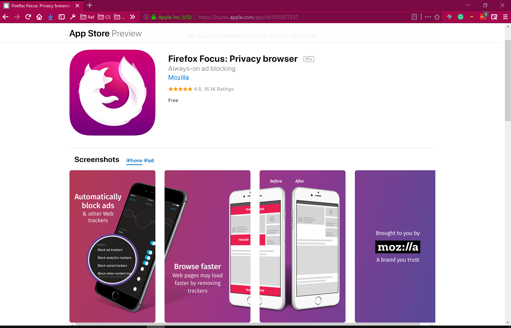
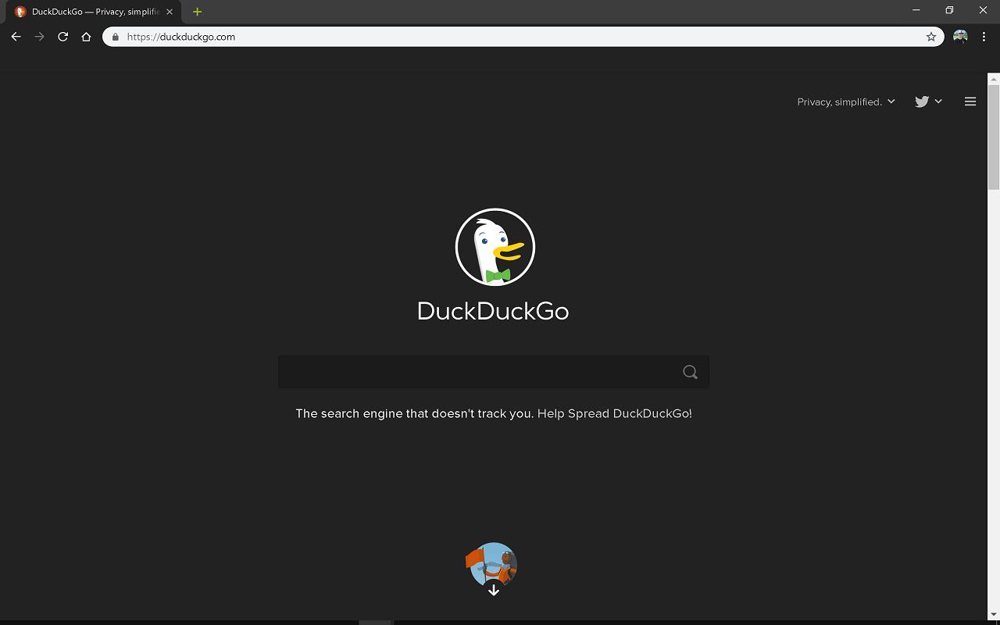

# ColorFox

Browser themes, created by Jack

# [Firefox Themes](https://addons.mozilla.org/en-US/firefox/user/13822940/)

### [DuckDuckGo Terminal](https://addons.mozilla.org/en-US/firefox/addon/duckduckgo-terminal/)

### [macOS Mojave Light Blue](https://addons.mozilla.org/en-US/firefox/addon/macos-mojave-light-blue/)

### [UNSW Yellow](https://addons.mozilla.org/en-US/firefox/addon/unsw-yellow/)

### [DuckDuckGo Default](https://addons.mozilla.org/en-US/firefox/addon/duckduckgo-default/)

### [Focus Color](https://addons.mozilla.org/en-US/firefox/addon/focus-color/)

### [Edge Notes](https://addons.mozilla.org/en-US/firefox/addon/edge-notes/)

## Chrome Themes

### [UNSW Homepage Colour](https://chrome.google.com/webstore/detail/unsw-homepage-colour/ojlaccnnglpcdlmoijfldnoamfaioifc)

### [DuckDuckGo Terminal](https://chrome.google.com/webstore/detail/pghedgpmkfnlfieeahanikjjfhkofkpe/publish-accepted?hl=en&gl=AU)

