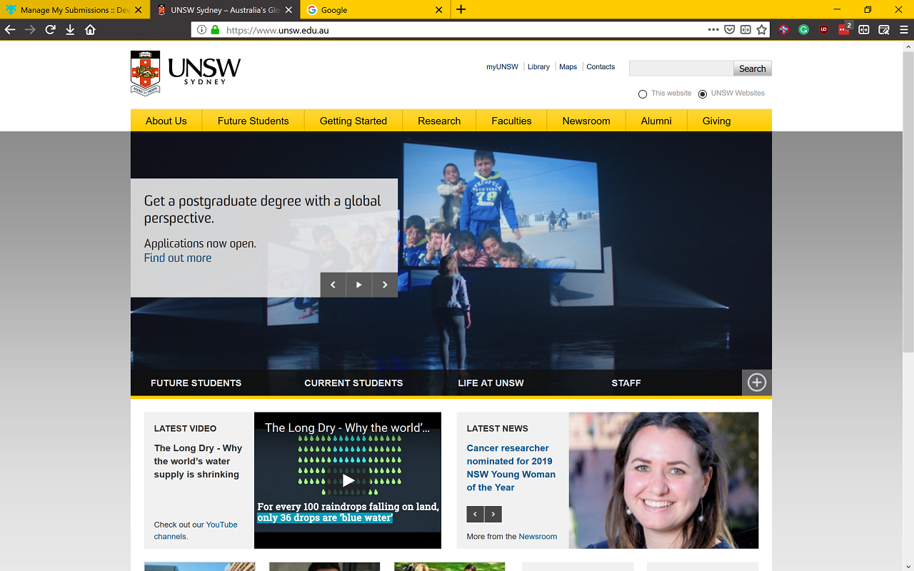

# UNSW Homepage Colour Theme
A colour theme inspired by [UNSW homepage](https://www.unsw.edu.au/)

This project is **NOT** related to any UNSW officials

## [Firefox Default_Theme](https://addons.mozilla.org/en-US/firefox/addon/unsw-homepage-colour/)

## [Chrome Default_Theme](https://chrome.google.com/webstore/detail/unsw-homepage-colour/ojlaccnnglpcdlmoijfldnoamfaioifc)

## Colour palette

### primary colour

maybe Yellow

- background: FFCC00 RPG(255,204,0)
- text: 000000 RPG(0,0,0)

### secondary colour

maybe dark grey

- background: 3B3738 RPG(59,55,56)
- text: FFFFFF PRG(255,255,255)
